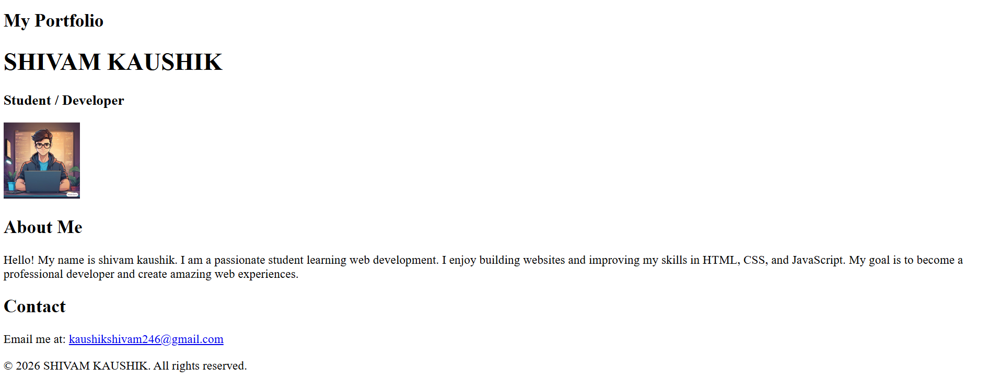

💼 HTML Resume – Beginner Project

This is my beginner-level HTML project where I created my resume using pure HTML while learning web development fundamentals.

🔧 Technologies Used

HTML5

📌 Features

Resume layout using HTML

Sections for summary, education, skills, and projects

Use of headings, lists, images, and links

Clean and beginner-friendly structure

🌐 Live Demo

👉 https://kaushikshivam-stack.github.io/html-resume-project/

🙌 What I Learned

Writing proper HTML boilerplate

Structuring real-world content using HTML

Using headings, lists, images, and anchor tags

Organizing files for a web project

Deploying a website using GitHub Pages

## 📸 Project Screenshot

⭐ This project represents my progress as a beginner web developer and will be improved further with CSS.
